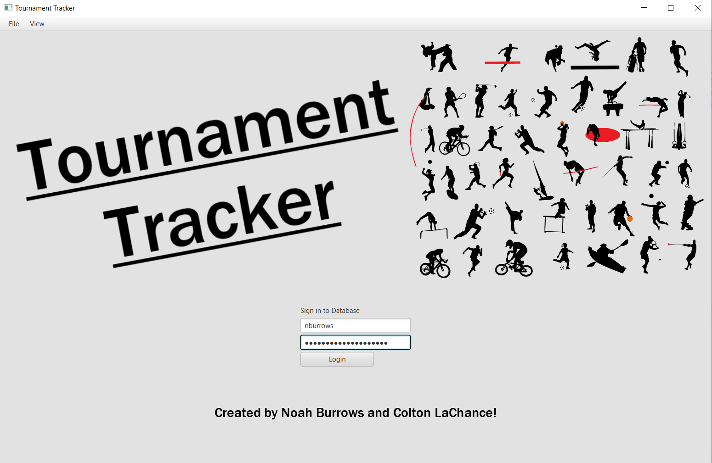

# Tournament Tracker

## Authors:
Noah Burrows and Colton LaChance

## Description

Tournament Tracker is a simple app used to keep track of tournaments, as the name would suggest. 
Users may log in to their account and keep track of many different tournament databases.
Tournament Tracker has support for singles tournaments, as well as team tournaments, and can
keep track of individual stats within these tournaments.

## Visuals

